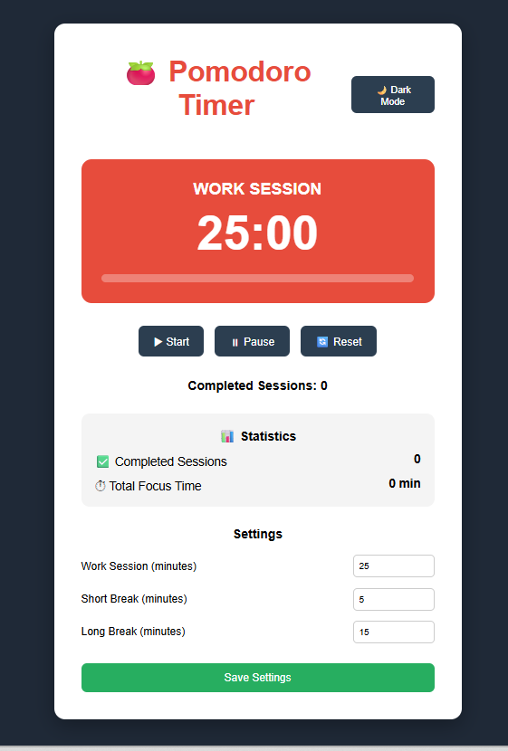
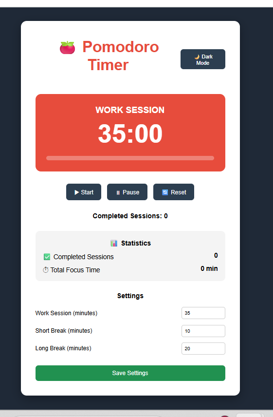
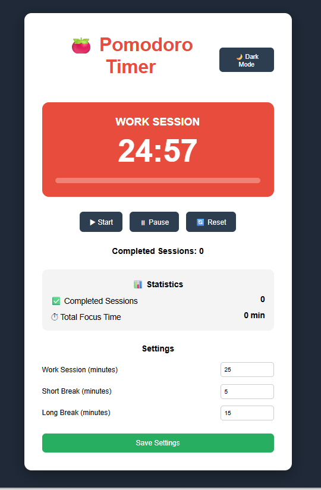
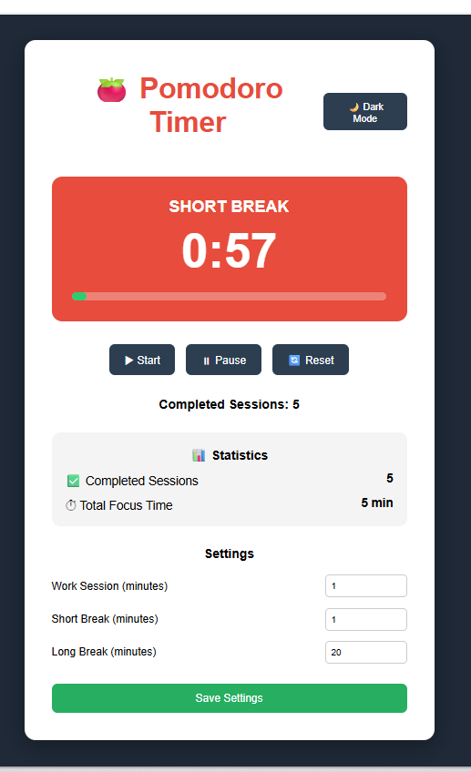
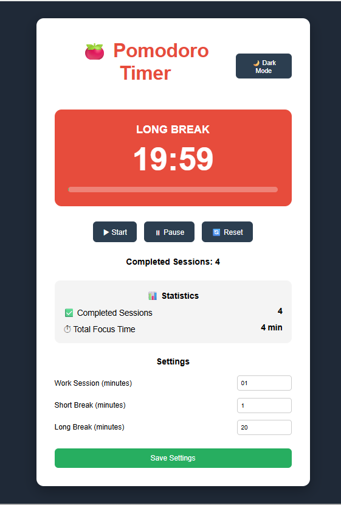
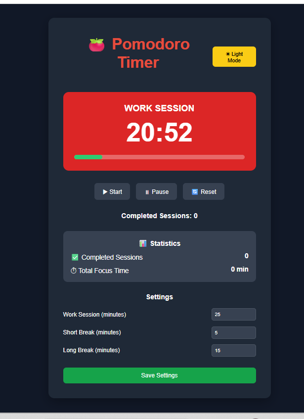
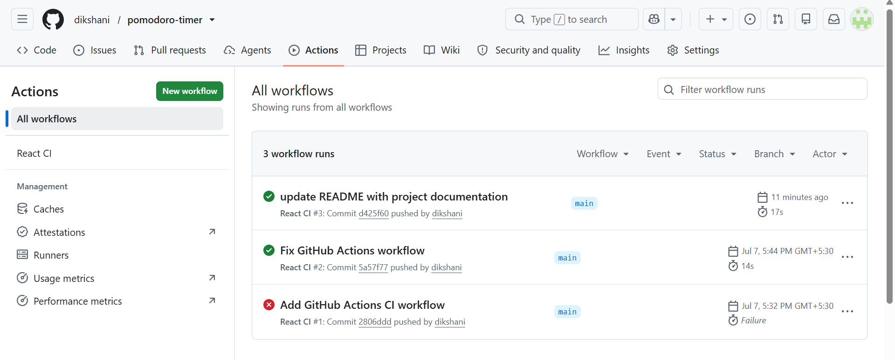
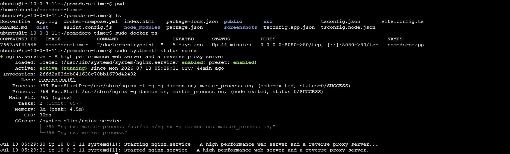

# ⏱️ Pomodoro Timer

A modern **Pomodoro Timer** application built using **React**, **TypeScript**, and **Vite**. This project was developed to practice both **Frontend Development** and **DevOps concepts**, including Docker containerization, Continuous Integration using GitHub Actions, and deployment on an AWS EC2 instance.

---

# 📷 Application Preview

> Add the application screenshot below after creating the `screenshots` folder.


---

# 🚀 Features

- ⏳ Work Session Timer
- ☕ Short Break Timer
- 🌴 Long Break Timer
- 🔄 Automatic Session Switching
- ▶️ Auto Start Next Session
- ⏯️ Start / Pause / Reset Controls
- ⚙️ Custom Timer Settings
- 💾 Local Storage Support
- 🔔 Notification Sound
- 📊 Session Counter
- 📱 Responsive User Interface

---

# 🛠️ Tech Stack

| Technology | Purpose |
|------------|---------|
| React | Frontend Development |
| TypeScript | Type Safety |
| Vite | Build Tool |
| HTML5 | Structure |
| CSS3 | Styling |
| Docker | Containerization |
| Docker Compose | Container Management |
| Nginx | Static File Server |
| GitHub Actions | Continuous Integration |
| AWS EC2 | Deployment |
| Git | Version Control |
| GitHub | Source Code Management |

---

# 📂 Project Structure

```text
pomodoro-timer/
│
├── src/
│   ├── components/
│   │   ├── Header.tsx
│   │   ├── Timer.tsx
│   │   ├── Controls.tsx
│   │   ├── Sessions.tsx
│   │   └── Settings.tsx
│   │
│   ├── App.tsx
│   ├── App.css
│   └── main.tsx
│
├── public/
├── screenshots/
│
├── .github/
│   └── workflows/
│       └── ci.yml
│
├── Dockerfile
├── docker-compose.yml
├── package.json
├── vite.config.ts
└── README.md
```

---

# ⚙️ Local Setup

## Clone Repository

```bash
git clone https://github.com/dikshani/pomodoro-timer.git
```

## Navigate to Project

```bash
cd pomodoro-timer
```

## Install Dependencies

```bash
npm install
```

## Run Development Server

```bash
npm run dev
```

Open your browser and visit:

```
http://localhost:5173
```

## Build for Production

```bash
npm run build
```

---

# 🐳 Docker

## Build Docker Image

```bash
docker build -t pomodoro-timer .
```

## Run Docker Container

```bash
docker run -d -p 8080:80 pomodoro-timer
```

Open:

```
http://localhost:8080
```

---

# 🐳 Docker Compose

Start the application using Docker Compose.

```bash
docker-compose up -d
```

Stop the application.

```bash
docker-compose down
```

---

# 🔄 Continuous Integration (GitHub Actions)

A GitHub Actions workflow automatically validates the application whenever changes are pushed to the **main** branch.

The workflow performs the following tasks:

- Checkout Repository
- Setup Node.js
- Install Dependencies
- Build React Application
- Verify Production Build

Workflow file:

```text
.github/workflows/ci.yml
```

---

# 🚀 DevOps Use Case

This project demonstrates how a frontend application can be managed using modern DevOps practices.

The project includes:

- Git-based version control
- Docker containerization
- Multi-stage Docker build
- Docker Compose
- Continuous Integration using GitHub Actions
- Production build generation
- Deployment on AWS EC2
- Serving static files using Nginx

This workflow represents the lifecycle of a production-ready frontend application from development to deployment.

---

# 💼 DevOps Skills Demonstrated

- Linux
- Git
- GitHub
- Docker
- Docker Compose
- GitHub Actions
- Continuous Integration (CI)
- AWS EC2
- Nginx
- Production Deployment
- Containerization
- Build Automation

---

# 📈 DevOps Workflow

```text
Developer
     │
     ▼
Git Commit
     │
     ▼
Git Push
     │
     ▼
GitHub Repository
     │
     ▼
GitHub Actions
     │
     ▼
Install Dependencies
     │
     ▼
Build React Application
     │
     ▼
Docker Image
     │
     ▼
Docker Container
     │
     ▼
Nginx
     │
     ▼
AWS EC2
     │
     ▼
End Users
```

---

# ☁️ Deployment

The application is deployed on an **AWS EC2 Ubuntu Server** using Docker and Nginx.

Deployment Components:

- AWS EC2
- Ubuntu Server
- Docker
- Docker Compose
- Nginx
- GitHub Actions

---

# 📸 Screenshots

## Home Page



---

## Settings



---

## Running Work Session



---

## Short Break



---

## Long Break



---

## Dark Mode



---

## GitHub Actions



---

## ec2 and docker Container



---

# 🔮 Future Enhancements

- Continuous Deployment (CD)
- Docker Hub Integration
- HTTPS using Let's Encrypt
- Reverse Proxy Configuration
- Kubernetes Deployment
- Monitoring using Prometheus and Grafana
- Infrastructure as Code using Terraform

---

# 👩‍💻 Author

**Diksha Ninave**

DevOps Engineer Intern

GitHub: https://github.com/dikshani
https://roadmap.sh/projects/pomodoro-timer
